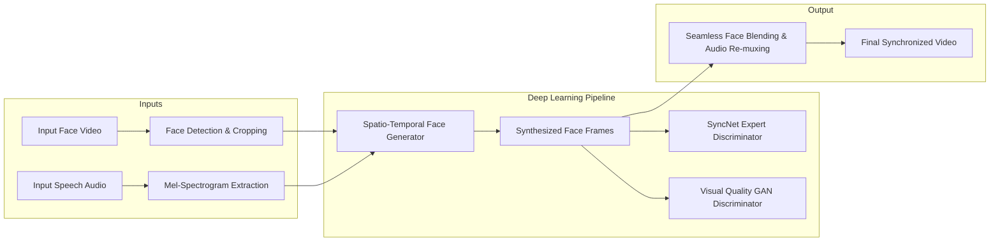

# Lipsync: Deep Audio-Visual Speech-to-Lip Synchronization

[](https://www.python.org/)
[](https://pytorch.org/)
[](https://opencv.org/)
[](https://ffmpeg.org/)
[](LICENSE)

An end-to-end deep learning pipeline that generates photorealistic, temporally synchronized lip movements for arbitrary talking-face videos conditioned on any input speech audio.

---

## 📌 Executive Overview

Audio-driven talking-face generation poses significant challenges in synchronization accuracy, visual realism, and identity preservation. **Lipsync** addresses these through a dual-objective approach:
1. **Expert Lip-Sync Discriminator:** Utilizes a pre-trained visual-audio synchronization evaluator (SyncNet) to guide the generator toward precise phonetic-to-viseme timing.
2. **Visual Quality GAN:** Employs an adversarial discriminator to penalize blurred artifacts and synthesize realistic facial contours, teeth textures, and skin tones.

The system is completely **identity-agnostic** and **language-agnostic**—capable of synchronizing any target face (real footage, animated avatars, CGI characters) with any voice source.

---

## 🧠 System Architecture



---

## ✨ Key Capabilities

- **In-the-Wild Robustness:** Handles dynamic head poses, variable lighting, head rotation, and occlusions.
- **Cross-Lingual & Multi-Voice:** Works seamlessly across diverse languages, accents, synthetic speech (TTS), and background music.
- **Identity & Emotion Preservation:** Retains original facial features, gaze, emotional tone, and upper-face expressions without distortion.
- **Modular Pipeline:** Flexible inference configurations with fine-grained control over bounding box padding, smoothing, and resolution downscaling.

---

## 🛠️ Tech Stack & Dependencies

- **Language:** Python 3.8+
- **Deep Learning Framework:** PyTorch (`torch`, `torchvision`)
- **Computer Vision:** OpenCV (`opencv-python`, `opencv-contrib-python`), S3FD Face Detector
- **Audio Processing:** Librosa, SoundFile, SciPy, Numba
- **Video & Multimedia Engine:** FFmpeg

---

## 📂 Project Structure

```text
Lipsync/
├── checkpoints/              # Directory for trained model weights (.pth)
│   └── README.md
├── face_detection/           # S3FD face detection modules & landmarks
│   ├── detection/sfd/        # S3FD architecture and inference scripts
│   └── api.py
├── models/                   # Neural network architectures
│   ├── wav2lip.py            # Generator & discriminator models
│   ├── syncnet.py            # SyncNet expert discriminator
│   └── conv.py               # Reusable convolutional building blocks
├── evaluation/               # Lip-sync error (LSE-C / LSE-D) benchmarking
├── filelists/                # Dataset splitting lists (train, val, test)
├── audio.py                  # Audio preprocessing & mel spectrogram generation
├── hparams.py                # Hyperparameter definitions
├── inference.py              # CLI inference engine for video generation
├── preprocess.py             # Dataset preprocessing pipeline
├── wav2lip_train.py          # Standard model training script
├── hq_wav2lip_train.py       # High-quality GAN training script
├── color_syncnet_train.py    # Expert discriminator training script
└── requirements.txt          # Python dependency specifications
```

---

## 🚀 Getting Started

### 1. Prerequisites

Ensure **FFmpeg** is installed and accessible via your system terminal:

```bash
# Verify installation
ffmpeg -version
```

- **Windows:** Download from [gyan.dev](https://www.gyan.dev/ffmpeg/builds/) or install via `winget install Gyan.FFmpeg`.
- **Linux / Ubuntu:** `sudo apt-get install -y ffmpeg`
- **macOS:** `brew install ffmpeg`

---

### 2. Environment Setup

Clone the repository and set up a clean Python virtual environment:

```bash
# Clone repository
git clone https://github.com/khxnhasnain/Lipsync.git
cd Lipsync

# Create and activate virtual environment
python -m venv venv

# Windows
.\venv\Scripts\activate

# Linux / macOS
source venv/bin/activate

# Install dependencies
pip install -r requirements.txt
```

---

### 3. Model Checkpoints

Download the pre-trained weights and organize them into the appropriate folders:

| Model | Description | Checkpoint Path | Download Link |
| :--- | :--- | :--- | :--- |
| **Wav2Lip** | Highly accurate lip synchronization | `checkpoints/wav2lip.pth` | [Download (Google Drive)](https://drive.google.com/drive/folders/153HLrqlBNxzZcHi17PEvP09kkAfzRshM?usp=share_link) |
| **Wav2Lip + GAN** | Better visual fidelity with sharp lip textures | `checkpoints/wav2lip_gan.pth` | [Download (Google Drive)](https://drive.google.com/file/d/15G3U08c8xsCkOqQxE38Z2XXDnPcOptNk/view?usp=share_link) |
| **S3FD Face Detector** | Required for face landmark extraction | `face_detection/detection/sfd/s3fd.pth` | [Download (Adrian Bulat)](https://www.adrianbulat.com/downloads/python-fan/s3fd-619a316812.pth) |

---

## 🎬 Running Inference

Generate a synchronized video from any video and audio file:

```bash
python inference.py \
    --checkpoint_path checkpoints/wav2lip_gan.pth \
    --face path/to/input_video.mp4 \
    --audio path/to/input_audio.wav \
    --outfile results/output.mp4
```

### Advanced Inference Options

| Flag | Default | Description |
| :--- | :--- | :--- |
| `--pads` | `0 10 0 0` | Bounding box adjustments `[top, bottom, left, right]`. Increase bottom padding (`--pads 0 20 0 0`) for chin coverage. |
| `--nosmooth` | `False` | Disables temporal smoothing across face detections. Useful when mouth boundaries jitter. |
| `--resize_factor` | `1` | Downsamples frame resolution (e.g. `2` or `3`) to handle high-resolution inputs more effectively. |
| `--static` | `False` | When input is a single image (`.jpg` / `.png`), keeps face static while driving lip animation. |
| `--box` | `-1 -1 -1 -1` | Specify manual crop region `[y1, y2, x1, x2]` if automatic detector misses face. |

---

## 🏋️ Training Pipeline

### Step 1: Preprocess Dataset (LRS2 or Custom)
```bash
python preprocess.py \
    --data_root path/to/lrs2_dataset/main \
    --preprocessed_root path/to/lrs2_preprocessed/ \
    --batch_size 32
```

### Step 2: Train Expert Lip-Sync Discriminator
```bash
python color_syncnet_train.py \
    --data_root path/to/lrs2_preprocessed/ \
    --checkpoint_dir checkpoints/syncnet/
```

### Step 3: Train Lip-Sync Generator (GAN)
```bash
python hq_wav2lip_train.py \
    --data_root path/to/lrs2_preprocessed/ \
    --checkpoint_dir checkpoints/wav2lip_gan/ \
    --syncnet_checkpoint_path checkpoints/syncnet/checkpoint.pth
```

---

## 📊 Benchmark Metrics

The repository includes standard evaluation metrics used in state-of-the-art lip-reading and synthesis research:
- **LSE-D (Lip Sync Error - Distance):** Measures Euclidean distance in audio-visual feature space (lower is better).
- **LSE-C (Lip Sync Error - Confidence):** Measures audio-visual synchronization confidence (higher is better).

Run evaluation benchmarks using scripts inside the [`evaluation/`](evaluation/) directory.

---

## 📜 Citations & Acknowledgments

This implementation builds upon the foundational research in audio-visual speech generation:

```bibtex
@inproceedings{wav2lip2020,
  author    = {Prajwal, K R and Mukhopadhyay, Rudrabha and Namboodiri, Vinay P. and Jawahar, C.V.},
  title     = {A Lip Sync Expert Is All You Need for Speech to Lip Generation In the Wild},
  booktitle = {ACM International Conference on Multimedia (ACM MM)},
  year      = {2020},
  pages     = {484–492}
}
```

---

## 👤 Author & Contact

**Hasnain Khan**  
GitHub: [@khxnhasnain](https://github.com/khxnhasnain)
